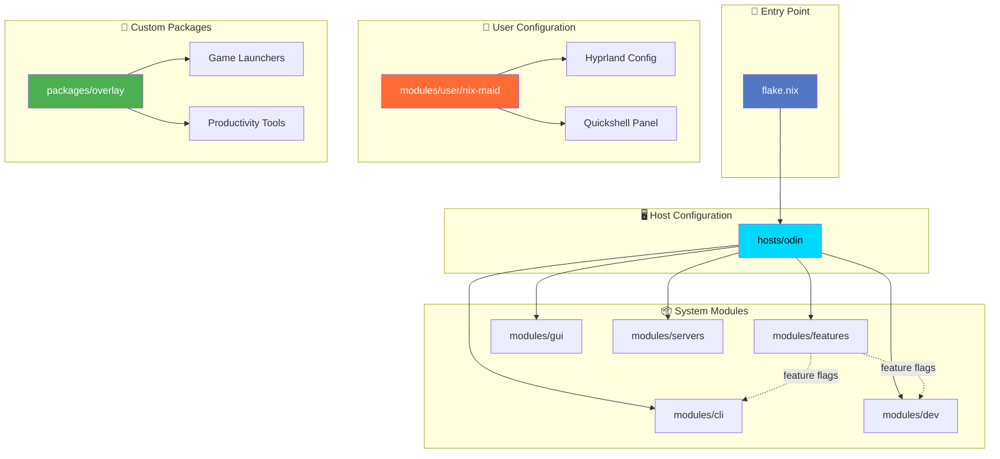
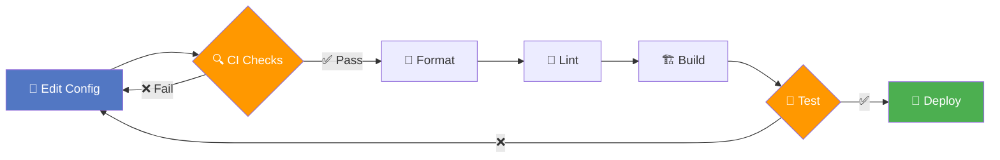
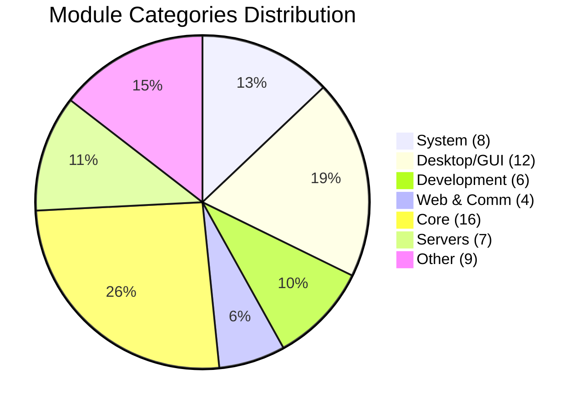
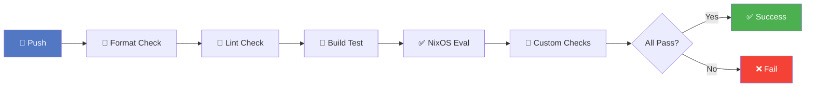
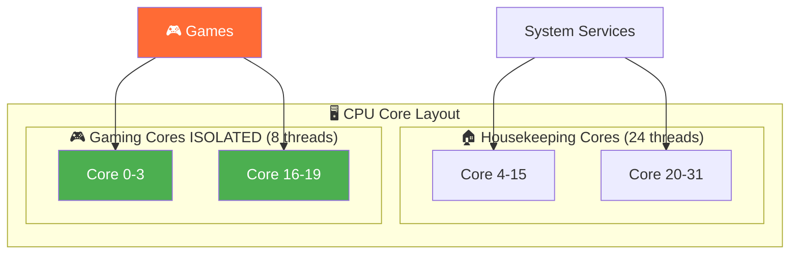

<div align="center">

```
███╗   ██╗██╗██╗  ██╗ ██████╗ ███████╗    ██████╗ ██████╗ ███╗   ██╗███████╗██╗ ██████╗ 
████╗  ██║██║╚██╗██╔╝██╔═══██╗██╔════╝   ██╔════╝██╔═══██╗████╗  ██║██╔════╝██║██╔════╝ 
██╔██╗ ██║██║ ╚███╔╝ ██║   ██║███████╗   ██║     ██║   ██║██╔██╗ ██║█████╗  ██║██║  ███╗
██║╚██╗██║██║ ██╔██╗ ██║   ██║╚════██║   ██║     ██║   ██║██║╚██╗██║██╔══╝  ██║██║   ██║
██║ ╚████║██║██╔╝ ██╗╚██████╔╝███████║   ╚██████╗╚██████╔╝██║ ╚████║██║     ██║╚██████╔╝
╚═╝  ╚═══╝╚═╝╚═╝  ╚═╝ ╚═════╝ ╚══════╝    ╚═════╝ ╚═════╝ ╚═╝  ╚═══╝╚═╝     ╚═╝ ╚═════╝ 
```

### 🚀 A Comprehensive, Modular NixOS Configuration
**Performance-Tuned • Developer-Focused • Gaming-Optimized**

[](https://github.com/neg-serg/nixos-config)
[](https://nixos.org)
[](https://hyprland.org)
[](https://github.com/neg-serg/nixos-config/commits)
[](https://github.com/neg-serg/nixos-config/stargazers)
[](LICENSE)

---

</div>

## 📖 Table of Contents

- [✨ Highlights](#-highlights)
- [🚀 Quick Start](#-quick-start)
- [📊 Project Statistics](#-project-statistics)
- [🏗️ Architecture](#️-architecture)
- [🎯 Key Features](#-key-features)
- [🗂️ Module Categories](#️-module-categories)
- [🔧 Development Workflow](#-development-workflow)
- [🎮 Gaming Setup](#-gaming-setup)
- [🌐 Hyprland Configuration](#-hyprland-configuration)
- [🛠️ Custom Packages](#️-custom-packages)
- [📚 Documentation](#-documentation)
- [🤝 Contributing](#-contributing)

---

## ✨ Highlights

> [!TIP]
> **New to NixOS?** Check out the [User Manual](docs/manual/README.md) for a comprehensive guide!

🎯 **What makes this configuration special:**

- 🚄 **Blazingly Fast Builds** - Optimized evaluation with module archiving
- 🎮 **Gaming-First Design** - CPU isolation, low-latency optimizations, VRR support
- 🔧 **Developer Paradise** - Multi-language support (Rust, C++, Haskell, Python), AI tools
- 🎨 **Beautiful Hyprland** - 21 workspaces, 6 scratchpads, custom Quickshell panel
- 📦 **30 Custom Packages** - Tailored tools for productivity and performance
- 🧩 **Modular Architecture** - 27 domain modules with feature flags, 403 Nix files
- 🔄 **Continuous Integration** - Automated formatting, linting, and testing

---

## 🚀 Quick Start

```bash
# 1️⃣ Clone the repository
git clone https://github.com/neg-serg/nixos-config /etc/nixos
cd /etc/nixos

# 2️⃣ Build and switch (with flakes)
sudo nixos-rebuild switch --flake .#odin

# 3️⃣ Or use the helper (if zcli is enabled)
nh os switch
```

> [!NOTE]
> Replace `odin` with your hostname if you're setting up a different machine.

---

## 📊 Project Statistics

<div align="center">

### 📈 By The Numbers

| 📁 Category | 🔢 Count | 📊 Progress |
|-------------|----------|-------------|
| **Module Domains** | 27 |  |
| **Nix Files** | 403 |  |
| **Custom Packages** | 30 |  |
| **Active Modules** | 403 |  |

| **Total Commits** | 4000+ |  |

</div>

---

## 🏗️ Architecture


```mermaid
graph TB
    subgraph "🎯 Entry Point"
        A[flake.nix]
    end
    
    subgraph "🖥️ Host Configuration"
        B[hosts/odin]
    end
    
    subgraph "📦 System Modules"
        C[modules/features]
        D[modules/cli]
        E[modules/dev]
        F[modules/gui]
        G[modules/servers]
    end
    
    subgraph "👤 User Configuration"
        H[modules/user/nix-maid]
        I[Hyprland Config]
        J[Quickshell Panel]
    end
    
    subgraph "🎁 Custom Packages"
        K[packages/overlay]
        L[Game Launchers]
        M[Productivity Tools]
    end
    
    A --> B
    B --> C
    B --> D
    B --> E
    B --> F
    B --> G
    H --> I
    H --> J
    C -.feature flags.-> D
    C -.feature flags.-> E
    K --> L
    K --> M
    
    style A fill:#5277C3,color:#fff
    style B fill:#00D9FF,color:#000
    style H fill:#FF6B35,color:#fff
    style K fill:#4CAF50,color:#fff
```

### 🔄 Build Flow


```mermaid
flowchart LR
    A[📝 Edit Config] --> B{🔍 CI Checks}
    B -->|✅ Pass| C[🎨 Format]
    B -->|❌ Fail| A
    C --> D[🔎 Lint]
    D --> E[🏗️ Build]
    E --> F{🧪 Test}
    F -->|✅| G[🚀 Deploy]
    F -->|❌| A
    
    style A fill:#5277C3,color:#fff
    style G fill:#4CAF50,color:#fff
    style B fill:#FF9800,color:#fff
    style F fill:#FF9800,color:#fff
```

---

## 🎯 Key Features

<details open>
<summary><h3>🎮 Performance & Gaming</h3></summary>

- ⚡ **CPU Isolation** - Dedicated cores (0-3,16-19) for gaming
- 🎯 **Custom Launch Scripts** - `game` (Rust): CPU isolation + gamescope presets
- 🚀 **Low-Latency Optimizations** - Kernel parameters, scheduler tweaks
- 🖥️ **VRR Support** - Variable Refresh Rate via Gamescope
- 🎪 **Immediate Mode** - For competitive games (CS2, osu!)

> [!TIP]
> **Steam Launch Options Example:**
> ```bash
> GAME_PIN_CPUSET=0-3,16-19 MANGOHUD=1 game-run gamescope -f --adaptive-sync -- %command%
> ```

</details>

<details>
<summary><h3>🔧 Development Environment</h3></summary>

**Languages & Tools:**
- 🦀 **Rust** - rustup, rust-analyzer, clippy, rustfmt
- ⚙️ **C/C++** - GCC, Clang, CMake, Ninja, LLDB
- 🎓 **Haskell** - GHC, Cabal, Stack, HLS
- 🐍 **Python** - Multiple versions, LSP, utilities
- 🤖 **AI/LLM** - Google Antigravity (optional), Codex integration
- ☁️ **IaC** - Terraform/OpenTofu support
- 🐳 **Containers** - Docker, Podman

> [!NOTE]
> Enable/disable languages via feature flags, e.g., `features.dev.rust.enable = true;`

</details>

<details>
<summary><h3>🪟 Window Management</h3></summary>

- 🎨 **Hyprland** - Dynamic tiling Wayland compositor

- 📐 **21 Workspaces** - Semantic routing (term, web, dev, games, etc.)
- 💾 **6 Scratchpads** - Telegram, Discord, Music, Torrents, System, Mixer
- 🎛️ **Quickshell Panel** - Custom status bar with system info

</details>

<details>
<summary><h3>🎵 Media Stack</h3></summary>

- 🎵 **MPD** - Music Player Daemon + clients (rmpc, ncmpcpp)
- ⬇️ **Transmission** - Torrent client + rustmission TUI
- 🎨 **AI Upscaling** - Real-time video enhancement (optional)
- 🔊 **PipeWire** - Modern audio server

</details>

---

## 🗂️ Repository Structure

```
📦 nixos-config/
├── 📄 flake.nix                      # 🎯 Flake entry point
├── 📂 hosts/                         # 🖥️ Host configurations
│   └── 📁 odin/                    # Primary workstation
│       ├── hardware.nix
│       ├── networking.nix
│       └── services.nix
├── 📂 modules/                       # 🧩 System modules (27 domains)
│   ├── 📁 features/                  # ⚙️ Feature flags (14 files)
│   │   ├── core.nix                 # Core feature options
│   │   ├── gui.nix                  # GUI stack options
│   │   ├── dev.nix                  # Development tools
│   │   └── ...
│   ├── 📁 cli/                       # 💻 CLI tools (10 files)
│   │   ├── tools.nix                # 65 packages
│   │   ├── dev.nix                  # Git, encoding, fetch
│   │   └── ...
│   ├── 📁 user/nix-maid/             # 👤 User configuration
│   │   ├── 📁 hyprland/              # 🌊 Hyprland (5 modules)
│   │   │   ├── main.nix
│   │   │   ├── workspaces.nix      # 21 workspaces
│   │   │   ├── scratchpads.nix     # 6 scratchpads
│   │   │   └── ...
│   │   └── ...
│   ├── 📁 servers/                   # 🖧 Server services
│   └── ...
├── 📂 packages/                      # 🎁 Custom overlays (30)
│   ├── game/
│   ├── rmpc/
│   └── ...
├── 📂 files/                         # 📝 Config files
│   ├── 📁 gui/hypr/                  # Hyprland configs
│   ├── 📁 quickshell/                # Panel configuration
├── 📂 scripts/dev/                   # 🔧 Dev & CI scripts
├── 📂 docs/                          # 📚 Documentation
│   └── 📁 manual/                    # User manual
```

---

## 🗂️ Module Categories

<div align="center">

### 📊 Module Distribution


```mermaid
pie title Module Categories Distribution
    "System (8)" : 8
    "Desktop/GUI (12)" : 12
    "Development (6)" : 6
    "Web & Comm (4)" : 4
    "Core (16)" : 16
    "Servers (7)" : 7
    "Other (9)" : 9
```

</div>

<details>
<summary><h3>🎯 Core Modules (16)</h3></summary>

| Module | Description | Files |
|--------|-------------|-------|
| 🎛️ **args** | Module arguments & impurity | 1 |
| ⚙️ **features** | Feature flags system | 15 |
| 📚 **neg** | Custom library helpers | 1 |
| 👥 **profiles** | Service profiles | 1 |

</details>

<details>
<summary><h3>💻 System Modules (8)</h3></summary>

- 🚀 **boot** - Boot loader & kernel
- 🔧 **hardware** - Hardware-specific settings
- 🌐 **net** - VPN, firewall, networking
- 🔒 **security** - Hardening & authentication
- 🖥️ **virt** - QEMU, Docker, Podman

</details>

<details>
<summary><h3>🎨 Desktop/GUI Modules (12)</h3></summary>

- 🪟 **gui** - Hyprland, Wayland, Qt
- 🔤 **fonts** - Font configuration
- 🎵 **media** - Audio/video apps
- 🎛️ **quickshell** - Panel config
- 🌈 **theme** - GTK/Qt theming

</details>

<details>
<summary><h3>🔧 Development Modules (6)</h3></summary>

- 💻 **dev** - Languages & tools
- 🤖 **llm** - LLM integration
- 📝 **text** - Editors & viewers
- 📚 **documentation** - Doc generators

</details>

<details>
<summary><h3>🌐 Web & Communication (4)</h3></summary>

- 🌍 **web** - Web browsing (Vivaldi)
- 📧 **mail** - Email (notmuch, isync)
- ⬇️ **torrent** - Torrent clients
- 💬 **im** - Instant messaging

</details>

<details>
<summary><h3>🖧 Server Modules (11 active)</h3></summary>

**🟢 Active Services:**
| Service | Purpose |
|---------|---------|
| 🔒 adguardhome | DNS-level ad blocking |
| 📡 avahi | mDNS/DNS-SD |
| 🎵 mpd | Music Player Daemon |
| 🔑 openssh | Remote access |


</details>

---

## 🔧 Development Workflow

### 🏃 Quick Commands

```bash
# 🐚 Enter development shell with all tools
nix develop

# 🎨 Format all code (nixfmt/treefmt)
just fmt

# 🔍 Run all checks (format + lint + build)
just check

# 🏗️ Build without switching
nixos-rebuild build --flake .#odin

# 🚀 Rebuild and switch
just deploy

# 🪝 Enable repo git hooks (lint + commit-msg scope check)
just hooks-enable
```

### 🔄 CI/CD Pipeline

> [!IMPORTANT]
> All changes are automatically validated via GitHub Actions


```mermaid
graph LR
    A[📝 Push] --> B[🎨 Format Check]
    B --> C[🔎 Lint Check]
    C --> D[🧪 Build Test]
    D --> E[✅ NixOS Eval]
    E --> F[🎯 Custom Checks]
    F --> G{All Pass?}
    G -->|Yes| H[✅ Success]
    G -->|No| I[❌ Fail]
    
    style A fill:#5277C3,color:#fff
    style H fill:#4CAF50,color:#fff
    style I fill:#f44336,color:#fff
```

**Automated Checks:**
- ✅ Code formatting (nixfmt/treefmt)
- ✅ Static analysis (statix)
- ✅ CSS syntax validation
- ✅ QML linting
- ✅ Shell script checks
- ✅ Full config evaluation

---

## 🎮 Gaming Setup

### ⚡ CPU Isolation Architecture

> [!TIP]
> **Pro Tip:** Reserve specific CPU cores for gaming to eliminate system interrupts!


```mermaid
graph TB
    subgraph "🖥️ CPU Core Layout"
        subgraph "🏠 Housekeeping Cores (24 threads)"
            A[Core 4-15]
            B[Core 20-31]
        end
        subgraph "🎮 Gaming Cores ISOLATED (8 threads)"
            C[Core 0-3]
            D[Core 16-19]
        end
    end
    
    G[System Services] --> A
    G --> B
    H[🎮 Games] --> C
    H --> D
    
    style C fill:#4CAF50,color:#fff
    style D fill:#4CAF50,color:#fff
    style H fill:#FF6B35,color:#fff
```

### 🚀 Launch Wrappers

```bash
# 🎯 Basic CPU pinning
game-run %command%

# 🖥️ With Gamescope (VRR + adaptive sync)
game-run gamescope -f --adaptive-sync -- %command%

# ⚡ Performance preset (low latency)
gamescope-perf %command%

# 🎨 Quality preset (visual fidelity)
gamescope-quality %command%

# 🌈 HDR support
gamescope-hdr %command%
```

> [!NOTE]
> **Steam Launch Options Example (Competitive FPS):**
> ```bash
> GAME_PIN_CPUSET=0-3,16-19 MANGOHUD=1 game-run gamescope -f --adaptive-sync -- %command%
> ```

### 🎛️ Environment Variables

| Variable | Purpose | Example |
|----------|---------|---------|
| `GAME_PIN_CPUSET` | Override CPU cores | `0-3,16-19` |
| `GAME_RUN_USE_GAMEMODE` | Toggle gamemode | `0` or `1` |
| `MANGOHUD` | Performance overlay | `1` |

---

## 🌐 Hyprland Configuration

### 📐 21 Workspaces

<div align="center">

| ID | Name | Icon | Purpose |
|----|------|------|---------|
| 1 | 𐌰:term | 💻 | Terminal |
| 2 | 𐌱:web | 🌐 | Web browsing |
| 3 | 𐌲:dev | 🔧 | Development |
| 4 | 𐌸:games | 🎮 | Gaming |
| 5 | 𐌳:doc | 📄 | Documents |
| 6 | 𐌴:draw | 🎨 | Graphics |
| 7 | 𐌵:vid | 📹 | Video |
| 8 | 𐌶:obs | 🎥 | OBS Studio |
| 9 | 𐌷:pic | 🖼️ | Pictures |
| 10 | 𐌹:sys | ⚙️ | System |
| 11 | 𐌺:vm | 💿 | Virtual Machines |
| 12 | 𐌻:wine | 🍷 | Wine/Proton |
| 13 | 𐌼:patchbay | 🎚️ | Audio Patchbay |
| 14 | 𐌽:daw | 🎹 | DAW |
| 15 | 𐌾:dw | 📊 | Data/DWM |
| 16 | 𐌿:keyboard | ⌨️ | Keyboard tools |
| 17 | 𐍀:im | 💬 | Instant Messaging |
| 18 | 𐍁:remote | 🖥️ | Remote Desktop |
| 19 | Ⲣ:notes | 📝 | Notes |
| 20 | 𐍅:winboat | 🪟 | Windows VM (floating) |
| 21 | 𐍇:antigravity | 🤖 | AI IDE |

</div>

### 💾 Hyprscratch Scratchpads

Quick-access overlays for common applications:

| Scratchpad | App | Keybind | Size |
|------------|-----|---------|------|
| 💬 **im** | Telegram | `Super+I` | 30% × 95% |
| 🎮 **discord** | Vesktop | `Super+D` | 50% × 40% |
| 🎵 **music** | RMPC | `Super+M` | 70% × 40% |
| ⬇️ **torrment** | Rustmission | `Super+T` | 98% × 40% |
| 📊 **teardown** | Btop | `Super+B` | 98% × 50% |
| 🔊 **mixer** | Pwvucontrol | `Super+V` | 40% × 90% |

---

## 🛠️ Custom Packages

**30 Custom Packages** tailored for productivity and performance:

### 🎮 Game
Rust launcher wrapper in `packages/game/`:
- `game-run` - CPU isolation wrapper with gamescope presets
### 🎵 Media
- `rmpc` - Modern MPD client (Rust)
- `rustmission` - Transmission TUI

### 💻 Productivity
- `two_percent` - Optimized fuzzy finder (skim fork)
- `duf` - Better `df` with plain style
- `comma` - Nix `,command` wrapper
- `pretty_printer` - CLI formatting utility

> [!NOTE]
> See [`packages/`](packages/) for the complete list.

---

## 📚 Documentation

| Resource | Description |
|----------|-------------|
| 📖 [User Manual](docs/manual/README.md) | Comprehensive guide |

| 💬 [Package Annotations](modules/) | Inline comments |
| 🔧 [CI Scripts](scripts/dev/) | Development tools |

---

## 🤝 Contributing

> [!IMPORTANT]
> This is a personal configuration, but contributions are welcome!

### 📝 Guidelines

1. 🍴 Fork the repository
2. 🌿 Create a feature branch
3. ✏️ Make your changes
4. ✅ Run `just check` to verify
5. 📬 Submit a pull request

### 🎨 Code Style

- ✅ Use `nixfmt` for formatting
- ✅ Follow existing patterns
- ✅ Test thoroughly before submitting

---

## 📜 License

This configuration is available under the **MIT License**.

---

## 🙏 Acknowledgments

<div align="center">

**Built with amazing open-source technologies**

[](https://nixos.org)
[](https://hyprland.org)
[](https://rust-lang.org)

Special thanks to:
- 🎯 [NixOS](https://nixos.org) - The reproducible Linux distribution
- 🌊 [Hyprland](https://hyprland.org) - Dynamic tiling Wayland compositor
- 👥 [nix-community](https://github.com/nix-community) - Tools and libraries

</div>

---

<div align="center">

### 🌟 Star this repo if you find it useful!

**Last Updated:** July 2026 • **Version:** 26.05 • **Commits:** 4000+

Made with ❤️ and ☕ by [neg-serg](https://github.com/neg-serg)

</div>
