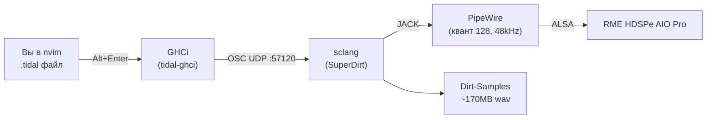

# TidalCycles на NixOS (odin)

## Архитектура



| Слой          | Что                                        | Порт                         |
| ------------- | ------------------------------------------ | ---------------------------- |
| TidalCycles   | Haskell DSL, паттерны ритма/звука          | отправляет OSC на :57120     |
| tidal-ghci    | GHCi с предзагруженным Tidal               | —                            |
| SuperDirt     | SuperCollider-синтезатор, загружает сэмплы | слушает OSC :57120           |
| scsynth       | Аудиосервер SuperCollider                  | OSC :57110, аудио через JACK |
| PipeWire JACK | Низколатентная аудиоподсистема             | квант 128 (2.6ms)            |

## Быстрый старт

Управление сессией — утилита `tidalctl` (пакет `pkgs.neg.tidalctl`, Rust):

```bash
tidalctl start     # запустить движок (SC сервер + SuperDirt, ~2с до звука)
tidalctl demo      # движок + открыть demo.tidal (многослойный джем)
tidalctl code      # открыть nvim в ~/src/art/music/tidal (создаёт при первом запуске)
tidalctl status    # процессы, OSC-порты, аудиоподключения
tidalctl stop      # остановить движок
tidalctl new имя   # создать новый .tidal файл
tidalctl record    # записать выход SuperDirt в ~/src/art/music/tidal/recordings/
tidalctl monitor   # live-мониторинг PipeWire (pw-top)
tidalctl patch     # патчбей ZestBay (distrobox)
```

В nvim:

- `Ctrl+Enter` — запустить GHCi (Tidal)
- Написать паттерн: `d1 $ sound "bd sn"`
- `Alt+Enter` — отправить строку в Tidal
- Услышать kick и snare — всё работает.

Остановка: `Ctrl+Shift+Enter` в nvim, или `tidalctl stop`.

## Музыкальные хелперы (BootTidal.hs)

Сокращения для инструментов (имена папок сэмплов):

```haskell
k    -- бочка (bd)          sn   -- рабочий (sn)
hh   -- хай-хэт             cp   -- клэп
bass -- бас-сэмплы          tab  -- табла
```

Ритмические фразы (вставляются в `sound`):

```haskell
d1 $ sound fourOnFloor   -- "bd(4,8) sn(3,8) hh*8"
d1 $ sound techno        -- "bd*2 sn(3,8) hh*4"
d1 $ sound halftime      -- "bd(2,8) sn(2,8) hh*6"
d1 $ sound jungle        -- "bd(3,8) sn(5,8) hh*6"
```

Генераторы случайности (перевыбираются каждый цикл):

```haskell
d1 $ randomGroove        -- случайная фраза ударных
d1 $ randomEuclid 8      -- случайный евклидов кик
d6 $ ambientPad          -- эмбиент-пад на случайном минорном аккорде
```

## Генеративные хелперы (алгоритмическая композиция)

Портированные техники из заметки «Формализуемая теория музыки для алгоритмической
композиции» — всё определено в `BootTidal.hs`, работает сразу после `<leader>tl`:

```haskell
-- Шиллингер: интерференция двух генераторов (периоды a и b), палиндром.
d1 $ resultant 3 2        -- "bd ~ bd bd bd ~"
d1 $ fast 2 $ resultant 5 3

-- Ксенакис: решето — удары там, где i mod m ∈ residues.
d1 $ sieve 3 [0,1]          -- октатонический пульс (классы {0,1} mod 3)
d1 $ slow 4 $ sieve 3 [0,1] # sound "hh"

-- Гамелан: колотомия — вложенные модульные циклы.
d1 $ slow 4 $ colotom 4 "gong"               -- гонг каждые 16 шагов
d2 $ slow 4 $ (0.5 <~) $ colotom 4 "kenong"  -- кенонг, полцикла со сдвигом

-- Взвешенная аккордовая прогрессия (0-порядковая марковская, I/IV/V/vi).
d1 $ weightedChords

-- Райх: фазирование — два слоя одного паттерна, один плывёт по темпу.
d1 $ phase8
d2 $ phase8 # speed 1.01  -- d2 медленно обгоняет d1

-- Мессиан, лад 2 (октатоника) полутоновыми номерами от C4.
d1 $ octatonic

-- Мессиан: лад 3 (2-1-1-2-1-1) и целотоновый лад 1.
d1 $ mode3
d1 $ wholeTone

-- Картер: метрическая модуляция — соотношение темпов.
d1 $ fast (modulate 4 6) $ sound "bd"   -- новый темп = 4/6 от старого

-- Гласс: аддитивный процесс — фигура растёт на `step` нот за цикл.
d1 $ glassAdd 4 3       -- 1 → 4 → 7 нот

-- Мессиан: интерверсия — палиндромная перестановка ритмической ячейки.
d1 $ interversion "bd sn hh cp"

-- L-система (пыль Кантора): фрактальный самоподобный ритм.
d1 $ lSystem 3

-- Клеточный автомат Вольфрама как ритм.
d1 $ caRule 110 16      -- правило 110: на грани хаоса
d1 $ caRule 30 16       -- правило 30: хаотичный

-- Шёнберг: додекафонный ряд (P/R/I/RI + транспозиция).
d1 $ row12 row                       -- прима от C4
d1 $ row12 (transp 3 row)            -- транспозиция на 3
d1 $ row12 (retr (invert row))       -- ракоходная инверсия

-- Индийские талы: ритмические циклы (хлопки).
d1 $ tala tintal   -- 16 долей (4+4+4+4)
d1 $ tala keharwa  -- 8 долей (4+4)
d1 $ tala rupak    -- 7 долей (3+2+2)

-- Греческие метрические стопы (краткий/долгий слог).
d1 $ fast 4 $ iambP     -- u-  ямб
d1 $ fast 4 $ trocheeP  -- -u  трохей
d1 $ fast 4 $ dactylP   -- -uu дактиль
d1 $ fast 4 $ anapestP  -- uu- анапест

-- Ксенакис: пуассоновская плотность (случайные удары, темп k).
d1 $ xenakisDensity 6

-- Лютославский: ограниченная алеаторика — высоты фиксированы, ритм рваный.
d1 $ aleatoric

-- Марковская цепь (1-й порядок, ударные): 7×bd, 3×sn, 4×hh.
d1 $ markovDrums

-- Мессиан: необратимый ритм (палиндром длительностей) + прибавленные стоимости.
d1 $ palindur
d1 $ addedValue 4     -- bd hh bd hh bd hh bd (valeur ajoutée)

-- 1/f (розовый) шум: фрактальная мелодия.
d1 $ fNoise

-- Перл: циклические множества — чередование интервальных циклов (mod 12).
d1 $ perleCycle 2 3
```

## Демо-джем (tidalctl demo)

`tidalctl demo` поднимает движок и открывает `~/src/art/music/tidal/demo.tidal` —
многослойную сцену (29 строк, орбиты d1–d16): отправляй строки сверху вниз
(`Alt+Enter`), каждый слой добавляется поверх. Каждый блок комментирует свою
технику: кик → снейр → хэты → случайный грув → бас → пад → мелодия → swing →
Шиллингер → Ксенакис → колотомия → L-система → клеточный автомат → интерверсия →
Гласс → додекафония → тала → греческие стопы → алеаторика → марков → Мессиан →
1/f → Перл. В конце — `hush`.

## Клавиши в nvim

Основные — leader-группа `<leader>t` (надёжно работает в терминалах, где
`Ctrl+Enter` часто приходит как обычный Enter):

| Клавиша       | Действие                          |
| ------------- | --------------------------------- |
| `<leader>tl`  | Запустить Tidal (GHCi)            |
| `<leader>tq`  | Остановить Tidal                  |
| `<leader>ts`  | Отправить текущую строку          |
| `<leader>tb`  | Отправить блок как одно выражение |
| `<leader>th`  | `hush` — заглушить всё            |
| `<leader>tz`  | Заглушить паттерн под курсором    |

Традиционные (если терминал их пропускает):

| Клавиша            | Действие                               |
| ------------------ | -------------------------------------- |
| `Ctrl+Enter`       | Запустить Tidal (GHCi)                 |
| `Ctrl+Shift+Enter` | Остановить Tidal                       |
| `Alt+Enter`        | Отправить текущую строку               |
| `Alt+Enter` (visual) | Отправить **каждую строку** выделения |
| `<leader><CR>`     | Отправить блок как одно выражение      |
| `<leader>d`        | Заглушить паттерн под курсором         |
| `<leader><Esc>`    | `hush` — заглушить всё                 |

> **Многострочные паттерны**: `Alt+Enter` в visual mode отправляет каждую непустую
> строку выделения **по отдельности** (несколько `d1 $ ...` строк в одном блоке — это
> корректный Tidal-стиль). GHCi-блок `:{ ... :}` трактует всё как одно выражение и
> падает на нескольких `d1` — поэтому построчная отправка, а не блок.
> `<leader>tb` — наоборот, отправляет блок как одно выражение (для одного паттерна,
> разбитого на несколько строк).

> **Подсветка**: `*.tidal` файлы получают яркую кастомную раскраску (модуль
> `tidal-color`): орбиты `d1..d16` — радужные цвета, операторы `$`/`#` — оранжевые,
> параметры (`sound`, `gain`, `pan`, ...) — мятные. Плюс haskell-парсер treesitter
> для строк и комментариев.

> **Умные действия** (модуль `tidal-actions`): `<leader>tl` / `Ctrl+Enter` сначала
> проверяют, слушает ли SuperDirt порт 57120 — если движок не запущен, вместо
> бесполезного старта GHCi показывается подсказка «`tidalctl start`». `Alt+Enter`
> и `hush` предупреждают, если Tidal-сессия не запущена. Никаких молчаливых
> no-op.

> **Важно**: SuperDirt-движок запускается **только** через `tidalctl start` (отдельный
> терминал) — tidal.nvim сам sclang не поднимает (без PipeWire-jack окружения scsynth падает
> с «jack server is not running»). Tidal из nvim подключается к уже работающему SuperDirt.

## Как это устроено (детали реализации)

### Компоненты

1. **`tidal-ghci`** — враппер `/run/current-system/sw/bin/tidal-ghci`. Запускает GHCi с пакетом
   Tidal, использует `BootTidal.hs` для автоимпорта.
1. **`tidalctl start`** — пайплайн `echo 'команды' | sclang -l startup.scd`, который запускает
   SuperDirt мгновенно.
1. **`sclang -l ~/.config/SuperCollider/superdirt_startup.scd`** — загружает сервер SC с 1M буферов,
   256 wire buffers, 64K нод.
1. **PipeWire JACK** — библиотека `libjack.so` из `pkgs.pipewire.jack` подменяет оригинальный JACK,
   направляя аудио в PipeWire. Квант 128 на 48kHz даёт задержку ~2.6ms.
1. **Dirt-Samples** — Nix-деривация `pkgs.neg.dirt-samples` (~170MB); startup-скрипт указывает
   `~dirt.loadSoundFiles` явный путь в nix store (никакой зависимости от `resolveRelative`/CWD).
1. **SuperDirt и Vowel** — nix-пакеты `pkgs.neg.superdirt` и `pkgs.neg.vowel`, симлинки в
   `~/.local/share/SuperCollider/Extensions/` (наравне с SC3plugins). Ручная установка quark'а через
   `install-superdirt-quark` больше не нужна.
1. **Свои сэмплы** — папка `~/src/art/music/tidal/samples/`: любая вложенная папка с wav становится
   звуком (имя папки = имя звука). Создаётся `tidalctl start` автоматически.

### Почему запуск мгновенный (0.2с)

Секрет в пайплайне:

```bash
(echo 'SuperDirt-команды') | sclang -l superdirt_startup.scd
```

`sclang` немедленно читает команды из stdin. `s.waitForBoot` в стартовом скрипте запускает
аудиосервер асинхронно. OSC-порт 57120 открывается мгновенно, аудио становится доступно через ~2
секунды. Никаких фиксированных sleep'ов.

## Паттерны Tidal: шпаргалка

### Звуки

```haskell
-- Простые ритмы
d1 $ sound "bd sn bd sn"       -- бочка, рабочий, бочка, рабочий
d2 $ sound "hh*4"              -- хай-хэт 4 удара за цикл
d3 $ sound "arpy cp"           -- арпеджио + клэп

-- Субпаттерны (скобки)
d1 $ sound "bd [sn cp] bd"     -- sn и cp одновременно
d1 $ sound "[bd sn, hh cp]"    -- выбор случайного из каждой пары

-- Евклидовы ритмы
d1 $ sound "bd(3,8)"           -- 3 удара на 8 шагов
d1 $ sound "bd(5,8)"           -- 5 ударов на 8 шагов
```

### Структура (время)

```haskell
-- Разная скорость
d1 $ fast 2 $ sound "bd sn"    -- вдвое быстрее
d1 $ slow 3 $ sound "bd sn"    -- втрое медленнее
d1 $ sound "bd sn" # speed 2   -- скорость семпла (питч)

-- Полиритмия
d1 $ sound "bd(3,8)"
d2 $ sound "hh(5,8)"           -- 3 против 5

-- Свинг
d1 $ swingBy (1/3) 4 $ sound "bd sn:2 hh*3"
```

### Эффекты

```haskell
-- Амплитуда и панорама
d1 $ sound "bd" # gain 1.2 # pan 0.5

-- Реверберация и задержка
d1 $ sound "arpy" # room 0.5 # size 0.8
d1 $ sound "arpy" # delay 0.5 # delaytime (1/3) # delayfeedback 0.7

-- Фильтры
d1 $ sound "bass" # lpf 400 # lpq 0.3      -- low-pass
d1 $ sound "bass" # hpf 200 # hpq 0.5      -- high-pass
d1 $ sound "hh" # bandf 1000 # bandq 0.7   -- band-pass

-- Дробилка (биткрашер)
d1 $ sound "bd" # crush 4

-- Дисторшн
d1 $ sound "bass" # shape 0.7

-- Кольцевая модуляция
d1 $ sound "arpy" # ring 0.5 # ringf 440

-- Огибающая
d1 $ sound "bd" # attack 0.1 # release 0.3 # cutoff 800
```

### Трансформации паттернов

```haskell
-- Реверсирование
d1 $ rev $ sound "bd sn"

-- Смещение во времени
d1 $ 0.25 <~ sound "bd sn"    -- сдвиг на 1/4 цикла

-- Повторение (статтер)
d1 $ stut 4 0.2 0.5 $ sound "bd"   -- 4 повтора с интервалом 0.2

-- Палиндром
d1 $ palindrome $ sound "bd sn hh"

-- Случайный порядок
d1 $ scramble 4 $ sound "bd sn cp hh"

-- Накопление
d1 $ iter 4 $ sound "bd sn hh"     -- сдвигать стартовую точку
```

### Тональные паттерны

```haskell
-- Ноты
d1 $ note "c d e f g a b" # sound "superpiano"

-- Арпеджио аккордов
d1 $ note (arp "up" "c'maj") # sound "superpiano"

-- Масштабы
d1 $ note (scale "minor" "c4") # sound "superpiano"

-- Глиссандо
d1 $ note "c e" # slide 0.5 # sound "superpiano"
```

### Случайность

```haskell
-- Случайный выбор
d1 $ sound (choose ["bd", "sn", "hh"])

-- Случайное число
d1 $ sound "bd" # gain (rand * 1.5)

-- Перемешивание каждые N циклов
d1 $ sometimes (fast 2) $ sound "bd sn"

-- С вероятностью
d1 $ often (|+| gain 0.3) $ sound "bd sn"

-- Редко
d1 $ rarely (rev) $ sound "bd sn"
```

## Аудиомаршрутизация

```bash
# Посмотреть граф PipeWire
tidalctl monitor          # watch pw-top

# Патчбей (соединить SuperDirt с выходами)
tidalctl patch       # pw-audioshare — GUI матрица

# Ручная коммутация
pw-link SuperDirt:out_0 "RME AIO Pro:playback_FL"
pw-link SuperDirt:out_1 "RME AIO Pro:playback_FR"
```

SuperDirt создаёт 12 орбит (моно-каналов). По умолчанию они микшируются в стереовыход.

## Запись

```bash
# Запись выхода SuperDirt в ~/src/art/music/tidal/recordings/ (имя с таймстампом)
tidalctl record

# Или вручную, в текущую директорию
pw-record --target $(pw-link -o | grep SuperDirt | head -1 | awk '{print $1}') recording.wav

# Или запись системного выхода
pw-record recording.wav
```

## Свои сэмплы

Любую папку с wav-файлами клади в `~/src/art/music/tidal/samples/` — имя папки станет именем звука:

```bash
mkdir -p ~/src/art/music/tidal/samples/mykit
cp kick.wav snare.wav ~/src/art/music/tidal/samples/mykit/
```

```haskell
d1 $ sound "mykit"     -- или "mykick" / "mysnare" (имена файлов без расширения)
```

Новые папки подхватываются после перезапуска движка (`tidalctl stop && tidalctl start`) или при
старте. Стандартный банк Dirt-Samples (218 звуков) загружается всегда.

## MIDI

`tidal-midi` временно отключён (сломан в nixpkgs). Когда починят:

```haskell
import Sound.Tidal.MIDI.Output
midi <- midiname "your-device"
d1 $ midi $ note "c d e f" # sound "midi"
```

## OSC во внешние синтезаторы

Параметры OSC (`pF`, `pI`, `pS`, …) доступны из `Sound.Tidal.Boot` без дополнительных импортов. Для
управления внешним синтезатором (например, через sclang/другой OSC-приёмник):

```haskell
d1 $ sound "bd" # pF "myParam" 0.5
```

## Устранение неполадок

### Нет звука

1. Проверить, что SuperDirt запущен: `ss -tuln | grep 57120` должен показать `0.0.0.0:57120`
1. Проверить, что scsynth запущен: `ss -tuln | grep 57110`
1. Проверить цепочку OSC: `tidal-ghci` должен отправлять на `localhost:57120`
1. Проверить аудиоподключения: `pw-link -l | grep SuperDirt`
1. Проверить громкость: в паттерне `# gain 1.5`, в системе `pwvucontrol`

### Потрескивания / xruns

1. Увеличить PipeWire квант: создать `~/.config/pipewire/pipewire.conf.d/99-tidal.conf`:
   ```
   context.properties = { default.clock.quantum = 512 }
   ```
1. Проверить загрузку CPU: `pw-top`
1. Закрыть тяжёлые приложения (браузер, компиляция)
1. Проверить `threadirqs` в параметрах ядра: `cat /proc/cmdline | grep threadirqs`

### SuperDirt не видит сэмплы

```bash
# Стандартный банк (nix store, путь задан в superdirt_startup.scd)
ls /run/current-system/sw/share/ 2>/dev/null | grep -i dirt  # или:
nix path-info /nix/store/*dirt-samples*/share/Dirt-Samples | head -1

# Свои сэмплы
ls ~/src/art/music/tidal/samples/
```

Если стандартные сэмплы не загружаются — проверить, что startup-скрипт
(`~/.config/SuperCollider/superdirt_startup.scd`) указывает на актуальный nix store путь
`pkgs.neg.dirt-samples` (путь генерируется при пересборке).

### "ghci not found"

Убедиться, что `tidal-ghci` в PATH:

```bash
which tidal-ghci
# Если нет — nixos-rebuild не завершён: sudo nixos-rebuild switch --flake /etc/nixos#odin
```

`LD_LIBRARY_PATH` должен содержать путь к PipeWire JACK. После перезахода в систему выставляется
автоматически. Проверить: `echo $LD_LIBRARY_PATH | grep pipewire`.

### SuperDirt запускается, но scsynth падает

Проверить, что PipeWire JACK запущен:

```bash
pw-cli ls Module | grep jack
# Должен показать: libpipewire-module-jackdbus-detect
```

Если нет: `systemctl --user restart pipewire`

### "No more buffer numbers" при загрузке сэмплов

Слишком много сэмплов для заданного лимита. Увеличить в
`~/.config/SuperCollider/superdirt_startup.scd`:

```
s.options.numBuffers = 1024 * 2048;  -- 2M буферов
```

Затем `sudo nixos-rebuild switch`.

## Советы

### Сохранение сессий

`.tidal` файлы — это обычный код. Держите их в `~/src/art/music/tidal/` (...). Рекомендую git.

### Быстрый перезапуск

Если паттерн «залип» (не обновляется):

- `Ctrl+Shift+Enter` — убить GHCi
- `Ctrl+Enter` — перезапустить
- Заново отправить паттерны

### Несколько окон

Держите три терминала:

1. Окно с `tidalctl start` (логи SC)
1. Окно с `tidalctl code` (nvim)
1. Окно с `tidalctl monitor` (мониторинг аудио)

### Автозапуск при логине

Добавить в автозапуск (через quickshell или systemd user service):

```bash
systemctl --user enable --now tidal.service
```

(Требуется создать unit-файл.)

## Файлы

| Путь                                                      | Назначение                           |
| --------------------------------------------------------- | ------------------------------------ |
| `~/.config/SuperCollider/superdirt_startup.scd`           | Конфигурация SC сервера (1M буферов) |
| `~/.config/SuperCollider/sclang_conf.yaml`                | Конфиг classpath (nix-maid)          |
| `~/.config/SuperCollider/boot_noop.scd`                   | Минимальная загрузка сервера         |
| `~/.config/tidal/BootTidal.hs`                            | Импорты и настройки GHCi             |
| `~/.local/share/SuperCollider/Extensions/SuperDirt/`      | Классы SuperDirt (nix-пакет)         |
| `~/.local/share/SuperCollider/Extensions/Vowel/`          | Формантные таблицы Vowel (nix-пакет) |
| `~/.local/share/SuperCollider/Extensions/SC3plugins/`     | SC3-Plugins классы (nix-пакет)       |
| `/nix/store/*dirt-samples*/share/Dirt-Samples/`           | Банк сэмплов (~170MB, nix store)     |
| `~/src/art/music/tidal/samples/`                              | Свои сэмплы (имя папки = имя звука)  |
| `~/src/art/music/tidal/`                                      | Рабочая директория для .tidal файлов |
| `/run/current-system/sw/bin/tidal-ghci`                   | GHCi враппер                         |
| `/etc/nixos/modules/user/nix-maid/apps/supercollider.nix` | Модуль NixOS                         |
| `/etc/nixos/docs/howto/tidal-cycles.md`                   | Этот документ                        |

## Ссылки

- [TidalCycles](https://tidalcycles.org/) — официальный сайт
- [TidalCycles Docs](https://tidalcycles.org/docs/) — туториалы и reference
- [SuperDirt](https://codeberg.org/musikinformatik/SuperDirt) — аудиодвижок
- [tidal.nvim](https://github.com/grddavies/tidal.nvim) — Neovim плагин
